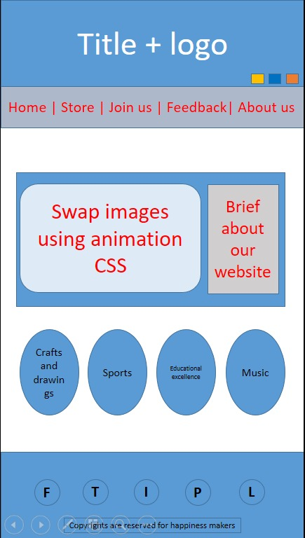
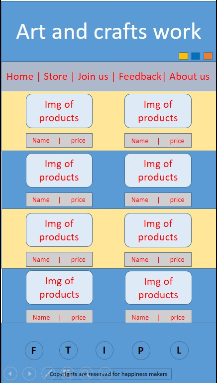
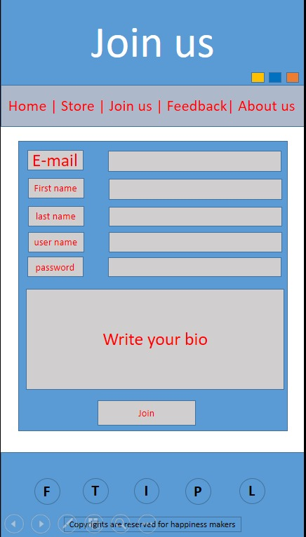
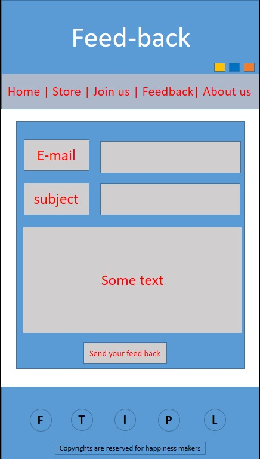
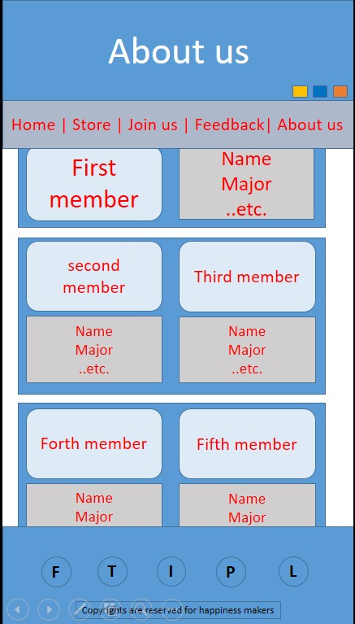
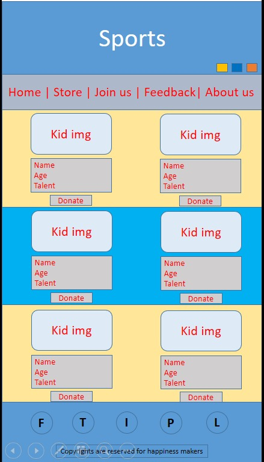
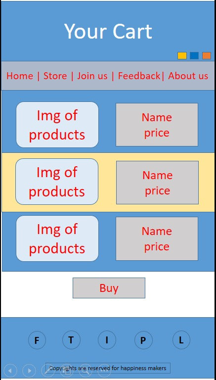
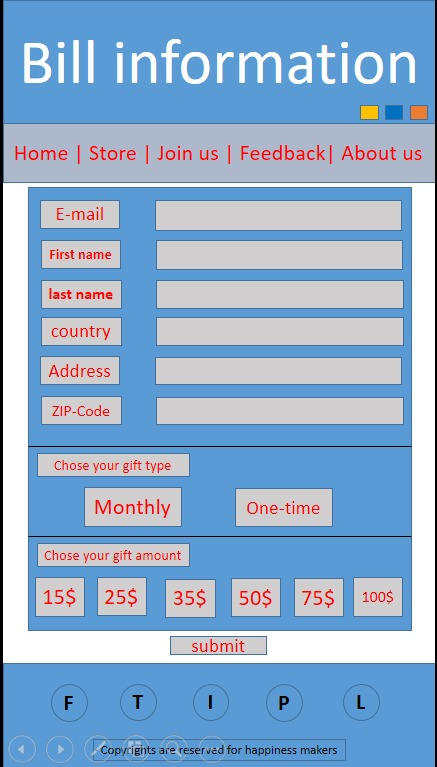

# kids-donations

#### Group members:
1. Osama abu mousa
2. Tsneem Al-Amarat
3. Majd Imar
4. Esra'a mamoun
5. Haneen abu dayeh

#### Project description
our project's problem domin is to target poor  Kids who have  talente all over the country. the main purpose is to give them a chance to present themselves to the community throughout their talents and make them feel productive and accomplished in a young age.
so we came up with this website idea; which is represent the talented kids in  different fileds  to the world and any one can buy any of theproducts that shown in the website or donate to support thier talent . at the end all the sales will go for this talented kids to benfit from their work or will goo to improve their skils.

#### Project Wierframe

##### Home Page

##### Store Page

##### Join us Page

##### Feed back Page

##### About us Page

##### category Page

##### Cart Page

##### bill information Page

